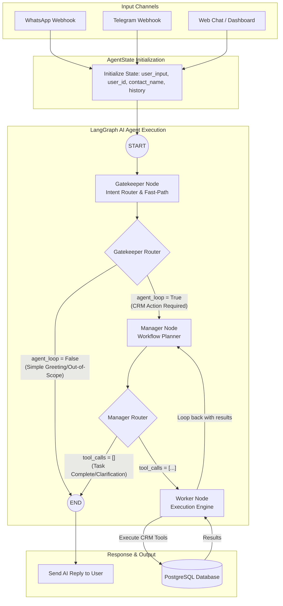

# AI Agent Execution Flow & Architecture

This document provides a detailed breakdown of the UM CRM AI Customer Service Agent execution flow. The agent is built using **LangGraph** and acts as an autonomous service layer capable of reading chat messages, determining intent, breaking down complex tasks, and executing CRM operations.

---

## 1. High-Level Agent Execution Flow

The AI Agent follows a **Stateful, Multi-Actor Triad-Node** structure. Rather than relying on a single, massive LLM prompt, the execution is divided into specialized nodes (Gatekeeper, Manager, Worker) to ensure deterministic outcomes and safe execution of database tools.

### Visual Flow Diagram

---

## 2. Input Channels & Entry Points

The system is designed to be agnostic to the origin of the message, relying on FastAPI webhooks to normalize external inputs before passing them to the LangGraph execution.

1. **WhatsApp (`/api/whatsapp`)**: The primary webhook that receives incoming WhatsApp payloads (powered by third-party APIs like Twilio/Meta). It extracts the sender's phone number, name, and message.
2. **Telegram (`/api/telegram`)**: Secondary webhook receiving Telegram bot payloads.
3. **Web Chat / Manual Input**: Used for internal testing or embedded dashboard chats.

**Initialization (`process_whatsapp_message` / `process_telegram_message`)**:
When a payload hits the webhook, the system normalizes the data and constructs an `AgentState` dictionary containing:
- `user_input`: The raw text from the customer.
- `user_id`: The ID of the authenticated Sales Representative associated with this client.
- `contact_name` & `phone`: Extracted metadata.
- `messages`: Contextual conversation history (limited to the last 5 turns).

---

## 3. The LangGraph Nodes

The LangGraph architecture compiles the `AgentState` through three primary nodes.

### Node 1: Gatekeeper (`gatekeeper_node`)
**Role:** Intent Router & Security Filter
- **Fast-Path Mechanism:** Uses regex to scan for simple greetings (e.g., "Hi", "Hello", "Thanks"). If detected, it immediately returns a static greeting, setting `agent_loop = False` to bypass expensive LLM inference.
- **Intent Parsing:** If it's a complex query, it queries the LLM (OpenRouter/Ilmu AI) to determine if the request is related to CRM tasks (e.g., logging a meeting, asking for a status).
- **Routing Decision:**
  - If CRM action is required: sets `agent_loop = True` -> routes to **Manager Node**.
  - If out-of-scope or a fast-path hit: sets `agent_loop = False` -> routes to **END**.

### Node 2: Manager (`manager_node`)
**Role:** Workflow Planner & Summarizer
- **Decomposition:** Analyzes the validated CRM intent and decomposes it into a list of specific Python tool calls.
- **JSON Formatting:** Outputs a structured JSON payload detailing which tools to execute and what arguments to pass (e.g., `[{"tool": "create_contact", "args": {"name": "John", "company": "Acme"}}]`).
- **Loop Handling:** When the Worker node returns execution results, the Manager node reads the success/failure state and generates the final natural language summary for the user.
- **Routing Decision:**
  - If tools are queued: routes to **Worker Node**.
  - If no tools are queued (task complete, or clarification needed): routes to **END**.

### Node 3: Worker (`worker_node`)
**Role:** Execution Engine
- **Tool Invocation:** Parses the JSON from the Manager node and dynamically calls the mapped Python functions from `CRM_TOOLS`.
- **Validation & Execution:** Runs Pydantic validation on the arguments. If valid, it executes the SQLAlchemy queries against the PostgreSQL database.
- **Error Handling:** If a database error or validation error occurs (e.g., hallucinated arguments), it captures the traceback and assigns it to `worker_error` in the state.
- **Routing Decision:** Always routes back to the **Manager Node** to evaluate the results.

---

## 4. CRM Tools (`CRM_TOOLS`)

The Worker node has access to a strict, whitelisted set of tools. The LLM is provided with the JSON schemas for these tools during the Manager node execution. 

### Core Database Operations:
- **Contacts:**
  - `create_contact`: Add a new customer to the database.
  - `get_contact` / `list_contacts`: Retrieve specific or searched contacts.
  - `update_contact`: Modify details like email or phone number.
- **Opportunities (Pipeline Management):**
  - `create_opportunity`: Open a new deal (lead, negotiation, won, lost).
  - `get_opportunity` / `list_opportunities`: Query deal stages and values.
  - `update_opportunity_stage`: Move a deal across the Kanban board via chat.
- **Activities (Interaction Logs):**
  - `create_activity`: Log a meeting, call, or email against a specific contact.
  - `list_activities`: Query history for a client.
- **Tasks:**
  - `create_task`, `get_task`, `list_tasks`, `update_task_status`: Manage actionable to-dos.
- **Chat & Dashboard State:**
  - `save_chat_message` / `get_chat_history`: Session memory management.
  - `get_dashboard`: Fetch high-level KPIs.
- **Knowledge Graph (Advanced Context):**
  - `query_knowledge_graph`, `add_kg_node`, `add_kg_edge`: Read and write dynamic relationship data for complex contextual retrieval.

---

## Summary
By decoupling the AI into a **Gatekeeper -> Manager -> Worker** loop, UM CRM ensures that the LLM cannot hallucinate direct database commands. The Manager plans the work, the Worker safely executes strictly typed Python functions, and the LangGraph state ensures that context is never lost during the execution loop.